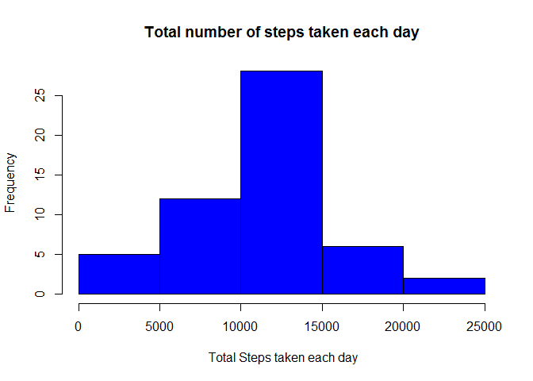
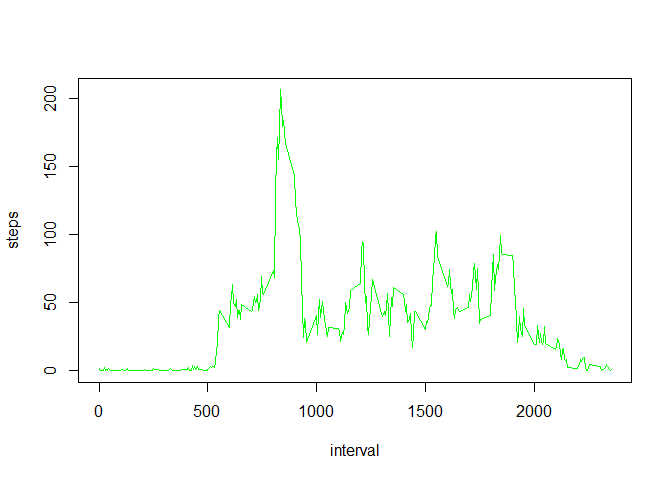
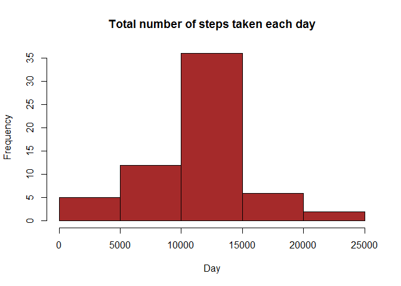

# Reproducible Research: Peer Assessment 1


## Loading and preprocessing the data

```r
activitydata<-read.csv("activity.csv ", colClasses = c("numeric", "character", "numeric"))
```
Understanding data and structure

```r
head(activitydata)
```

```
##   steps       date interval
## 1    NA 2012-10-01        0
## 2    NA 2012-10-01        5
## 3    NA 2012-10-01       10
## 4    NA 2012-10-01       15
## 5    NA 2012-10-01       20
## 6    NA 2012-10-01       25
```

```r
str(activitydata)
```

```
## 'data.frame':	17568 obs. of  3 variables:
##  $ steps   : num  NA NA NA NA NA NA NA NA NA NA ...
##  $ date    : chr  "2012-10-01" "2012-10-01" "2012-10-01" "2012-10-01" ...
##  $ interval: num  0 5 10 15 20 25 30 35 40 45 ...
```
Converting 'date' to date class :

```r
activitydata$date <- as.Date(activitydata$date, "%Y-%m-%d")
```
## What is mean total number of steps taken per day?
I used aggregate function to calculate above.

```r
StepsTotal <- aggregate(steps~date, data=activitydata, FUN=sum, na.rm = TRUE)
```
Making a histogram of the total number of steps taken each day

```r
hist(StepsTotal$steps, main = "Total number of steps taken each day", col ="blue", xlab= " Total Steps taken each day")
```

 

Calculating and reporting the mean and median of the total number of steps taken per day

```r
mean(StepsTotal$steps)
```

```
## [1] 10766.19
```

```r
median(StepsTotal$steps)
```

```
## [1] 10765
```
## What is the average daily activity pattern?
Making a time series plot (i.e. type = "l") of the 5-minute interval (x-axis) and the average number of steps taken, averaged across all days (y-axis)

```r
ts<-aggregate(steps~interval, data=activitydata, FUN=mean, na.rm=TRUE)
plot(ts, type = "l", col="green")
```

 

The following 5-min interval, on average across all the days in the dataset, contains the maximum number of steps:

```r
ts[which.max(ts$steps), ]
```

```
##     interval    steps
## 104      835 206.1698
```
## Imputing missing values
Calculating and reporting the total number of missing values in the dataset (i.e. the total number of rows with NAs)

```r
sum(is.na(activitydata))
```

```
## [1] 2304
```
Devising a strategy for filling in all of the missing values in the dataset : Using the mean for that 5-minute interval.

```r
NAfill <- numeric()
for (i in 1:nrow(activitydata)) {
  observation<- activitydata[i, ]
  if (is.na(observation$steps)) {
    steps <- subset(ts, interval == observation$interval)$steps
  } else {
    steps <- observation$steps
  }
  NAfill <- c(NAfill, steps)
}
```
Creating a new dataset that is equal to the original dataset but with the missing data filled in.

```r
newdata<-activitydata
newdata$steps<-NAfill
```
Making a histogram of the total number of steps taken each day. 

```r
StepsTotalNoNA <- aggregate(steps ~ date, data = newdata, sum, na.rm = TRUE)
hist(StepsTotalNoNA$steps, main = "Total number of steps taken each day", xlab = "Day", col = "brown")
```

 

Calculating and reporting the mean and median total number of steps taken per day.

```r
mean(StepsTotalNoNA$steps)
```

```
## [1] 10766.19
```

```r
median(StepsTotalNoNA$steps)
```

```
## [1] 10766.19
```
These values differ from the estimates from the first part of the assignment. The mean is the same after replacing missing values however the median is different. Interestingly, both mean and median are similar now. 

##Are there differences in activity patterns between weekdays and weekends?
Using weekdays() funtion

```r
day<-weekdays(newdata$date)
```
Creating a new factor variable in the dataset with two levels - "weekday" and "weekend" indicating whether a given date is a weekday or weekend day.

```r
daytype<-vector()
for (i in 1:nrow(newdata)){
    if (day[i] == "Saturday"){
  daytype[i]="weekend"
} else if (day[i]== "Sunday"){
  daytype[i]="weekend"
} else {daytype[i] ="weekday"
}
}
summary(daytype)
```

```
##    Length     Class      Mode 
##     17568 character character
```

```r
newdata$daytype<-daytype
stepsintweek<-aggregate(steps~interval+daytype, data = newdata, FUN = mean)
```
Making the panel plot comparing the average number of steps taken per 5-minute interval across weekdays and weekends

```r
library(lattice)
xyplot(steps~interval| daytype, data = stepsintweek, type ="l", layout = c(1,2), xlab = "Interval", ylab = "Number of Steps")
```

 

We can see from above plots that peak activity is more pronounced during weekday for this subject followed by steady activity throught out the observation period, indicating this individuals weekday routine. 
